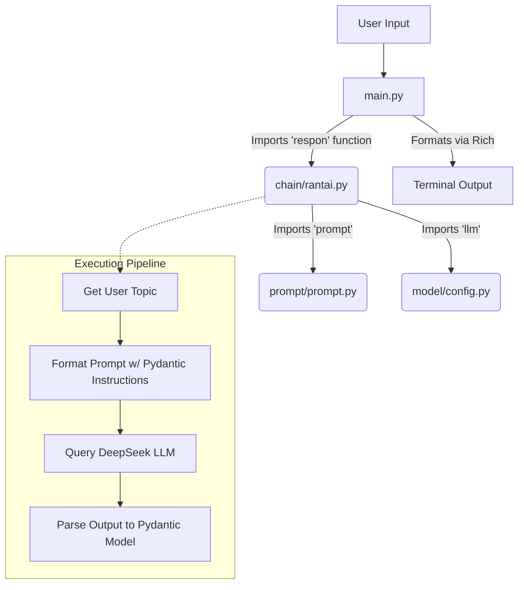

# LangChain Basic QA Assistant

A simple terminal-based Question-and-Answer AI assistant built using LangChain and DeepSeek. The assistant acts as an elementary school science teacher, providing simple and easy-to-understand explanations for any given topic, complete with daily life examples.

## Features

- **Interactive Terminal UI:** Uses `rich` to provide a beautifully formatted markdown output directly in your console.
- **Structured Output:** Uses LangChain's `PydanticOutputParser` to ensure the AI always responds with a strict format: a definition and an enumerated list of examples.
- **Custom Persona:** Driven by a tailored system prompt to explain complex topics like a 5th/6th-grade science teacher.
- **DeepSeek Integration:** Powered by the `deepseek-chat` model for high-quality responses.

## Project Structure & Flow

The codebase is highly modular, splitting concerns into distinct files (Model Configuration, Prometheus/Prompts, Chain Logic, and the Main Runner).

### Architecture Diagram



### Module Descriptions

- **`main.py`**: The entry point of the project. It handles user input, calls the processing chain, and beautifully renders the output to the terminal using the `rich` library.
- **`chain/rantai.py`**: Contains the core LangChain pipeline (`prompt | llm | parser`). It defines the expected data structure using Pydantic (`Penjelasan`) and extracts the requested topic as a structured object.
- **`model/config.py`**: Handles initialization of the LLM (`ChatDeepSeek`) and loads the necessary API keys from the `.env` file.
- **`prompt/prompt.py`**: Defines the `ChatPromptTemplate` that sets the persona of the AI (a science teacher) and injects the formatting instructions.

## Requirements

1. Python 3.x
2. An active DeepSeek API Key.

Define your `.env` file in the root directory:
```env
DEEPSEEK_API=your_api_key_here
```

## How to Run

Simply run the main script to start chatting:

```bash
python main.py
```
